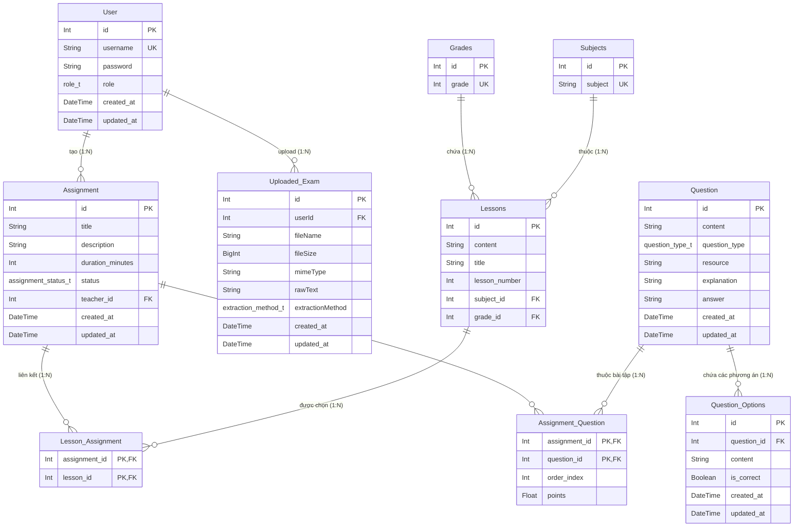
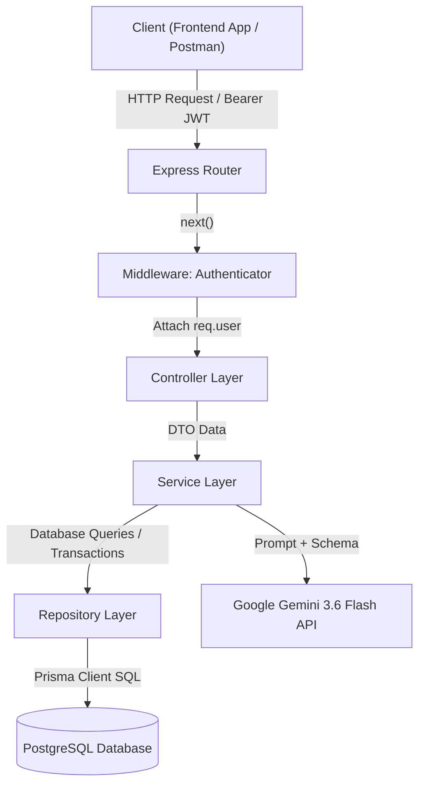
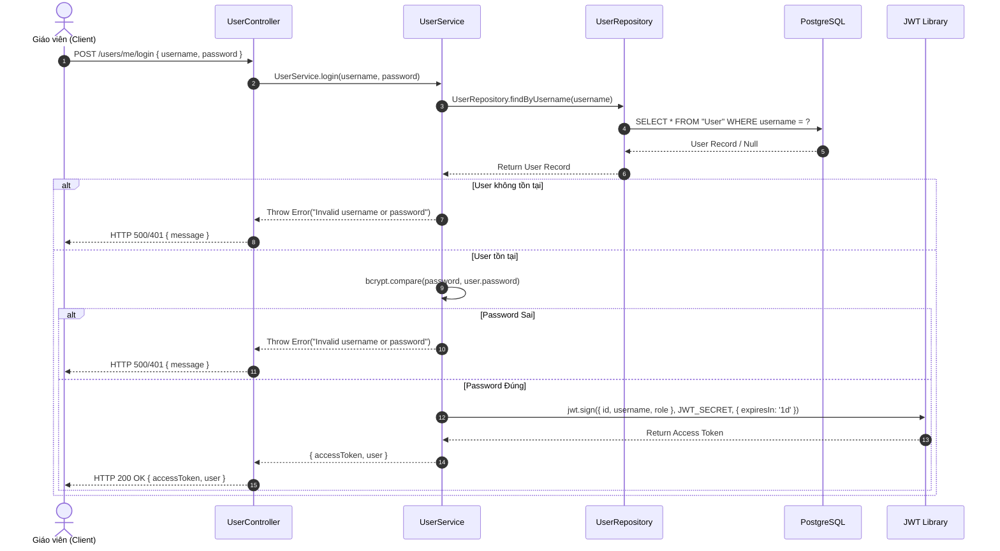
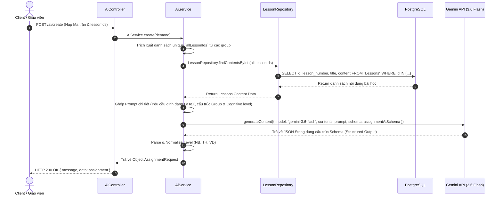
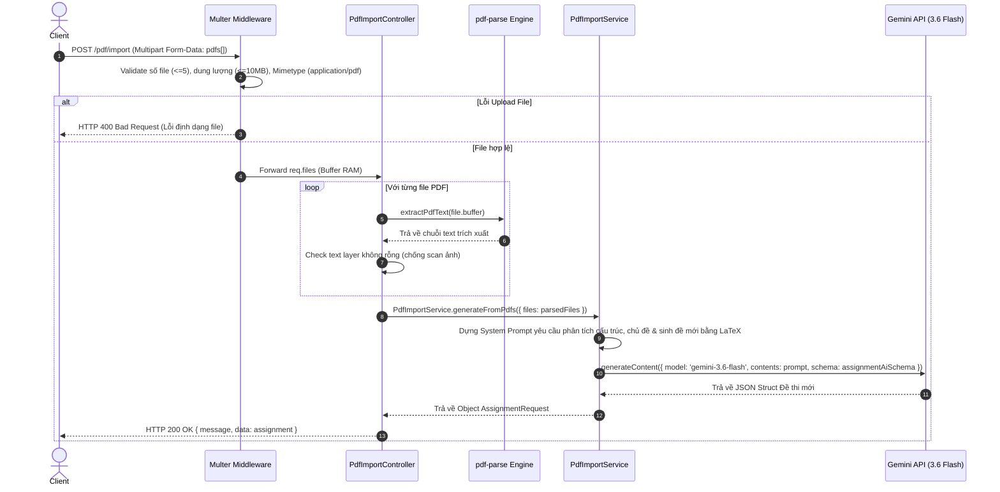
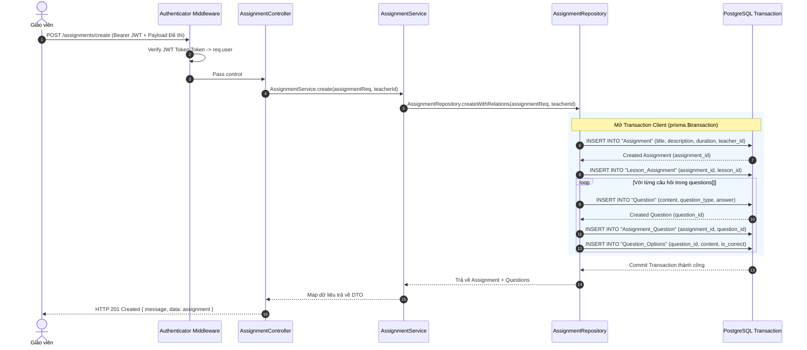
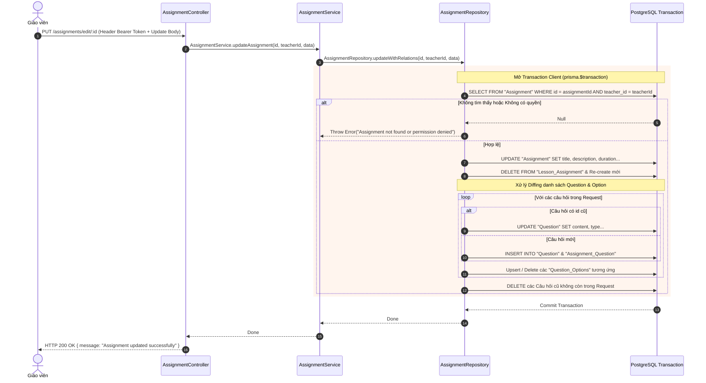
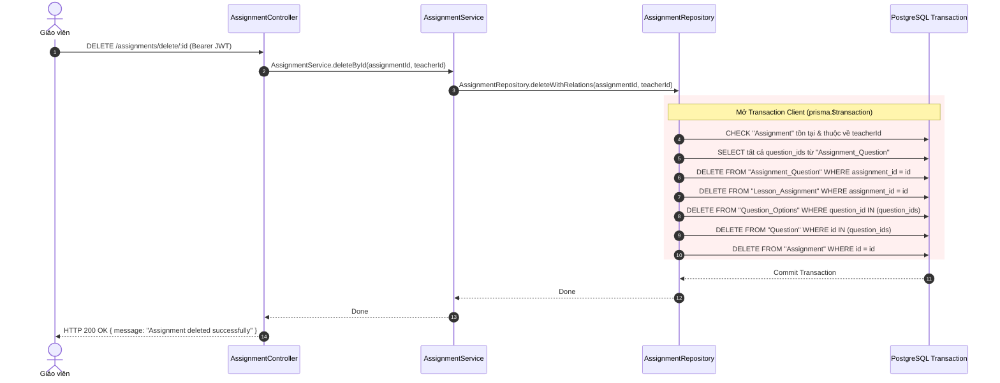

# TECHNICAL DESIGN DOCUMENTATION - BACKEND SYSTEM (EDTECH PLATFORM)

---

## 1. TECH STACK (CÔNG NGHỆ SỬ DỤNG)

| Thành phần | Công nghệ / Thư viện | Mức phiên bản | Vai trò & Lý do lựa chọn |
| :--- | :--- | :--- | :--- |
| **Runtime Engine** | Node.js | v20+ (ES Modules) | Xử lý bất đồng bộ (Async I/O) hiệu năng cao, tối ưu cho API Gateway và các tác vụ I/O heavy. |
| **Language** | TypeScript | `^5.9.3` | Strong typing, giúp phát hiện lỗi từ compile-time, tăng tính bảo trì và độ tin cậy của mã nguồn. |
| **Web Framework** | Express.js | `^5.2.1` | Minimalist web framework phổ biến, nâng cấp v5 hỗ trợ async error handling mượt mà hơn. |
| **Database** | PostgreSQL | v15+ | Hệ quản trị cơ sở dữ liệu quan hệ (RDBMS) chuẩn ACID, hỗ trợ truy vấn quan hệ phức tạp và toàn vẹn dữ liệu. |
| **ORM & Driver** | Prisma ORM & `@prisma/adapter-pg` | `^7.9.1` | Type-safe ORM với Prisma Client, kết hợp Driver Adapter `pg.Pool` cho phép quản lý Connection Pooling tối ưu. |
| **AI Engine Integration** | Google GenAI SDK | `^2.16.0` | Tích hợp trực tiếp với model **`gemini-3.6-flash`**, hỗ trợ **Structured Outputs** (`responseSchema`) để ép kiểu JSON đầu ra chính xác 100%. |
| **Authentication** | JSON Web Token (`jsonwebtoken`) & `bcrypt` | `^9.0.3` / `^6.0.0` | Xác thực stateless bằng JWT Bearer Token, mã hóa mật khẩu người dùng chuẩn Bcrypt với Salt round = 10. |
| **File Processing & Storage** | `multer` & `pdf-parse` | `^2.1.1` / `^2.4.5` | Multer xử lý Upload file lưu tạm trên Memory Buffer (RAM). `pdf-parse` đọc và trích xuất **text layer** từ tài liệu PDF. |
| **OCR Engine (Scanned PDF)** | `pdf-to-img` & `tesseract.js` | `^6.2.0` / `^7.0.0` | `pdf-to-img` render từng trang PDF (scale 2x) thành ảnh bitmap; `tesseract.js` chạy OCR cục bộ với ngôn ngữ `vie` để trích xuất text cho **PDF không có text layer** (PDF scan ảnh). |
| **Testing Framework** | Vitest | `^4.1.11` | Test runner tốc độ cao, ESM-native, tích hợp `vi.mock`/`vi.spyOn`, chạy 106 test (Unit/Integration/OCR/E2E/Performance/Quality) qua `pnpm test`. |
| **Development & Tooling** | `tsx`, `tsconfig-paths`, `dotenv` | `^4.21.0` / `^4.2.0` | Thực thi và nạp mô hình TypeScript trực tiếp không cần compile trung gian trong môi trường dev; nạp biến môi trường. |

---

## 2. FOLDER STRUCTURE CỦA MODULE (CẤU TRÚC THƯ MỤC BACKEND)

Hệ thống được thiết kế theo kiến trúc **3-Tier Architecture** chuẩn (Controller - Service - Repository Pattern), phân tách rõ ràng trách nhiệm giữa xử lý HTTP Request, Business Logic và Data Access Layer.

```
backend/
├── .env                         # Biến môi trường (DATABASE_URL, JWT_SECRET, GEMINI_API_KEY, PORT...)
├── .env.example                 # Mẫu cấu hình môi trường
├── package.json                 # Khai báo dependencies & scripts
├── tsconfig.json                # Cấu hình TypeScript compiler & path aliases (@/*)
├── prisma.config.ts             # Cấu hình Prisma CLI
├── prisma/
│   └── schema.prisma            # Định nghĩa Data Model, Enums & Database Migration Config
├── scripts/
│   ├── create-admin.ts          # Script CLI tạo tài khoản Admin ban đầu
│   └── generate-test-fixtures.ts # Sinh fixture PDF tổng hợp cho bộ test (chạy CLI hoặc import từ global-setup)
└── src/
    ├── index.ts                 # Entry point: Khởi tạo Express app, Middlewares & Server Listener
    ├── config/                  # Cấu hình kết nối hạ tầng
    │   ├── db.ts                # Native DB config
    │   ├── prisma.ts            # Khởi tạo PrismaClient sử dụng PrismaPg adapter
    │   ├── gemini.ts            # Khởi tạo instance GoogleGenAI SDK với GEMINI_API_KEY
    │   └── deepseek.ts          # Cấu hình bổ sung cho các mô hình AI khác (nếu mở rộng)
    ├── controllers/             # HTTP Request Handlers (Validate request, gọi Service, trả về HTTP Status Code)
    │   ├── users.ts             # Xử lý Login & Register
    │   ├── assignments.ts       # Xử lý CRUD Đề thi/Bài tập & Lấy danh mục Khối/Môn/Bài
    │   ├── ai.ts                # Xử lý Request sinh đề tự động bằng AI Gemini
    │   └── pdfImport.ts         # Xử lý Request tải file PDF, trích xuất raw text, lưu UploadedExam và sinh đề mới bằng AI
    ├── services/                # Business Logic Layer (Xử lý nghiệp vụ chính, tính toán, kết nối AI)
    │   ├── users.ts             # Mã hóa password, xác thực tài khoản, tạo JWT Token
    │   ├── assignments.ts       # Điều phối dữ liệu bài tập, ghép nối thông tin Khối/Môn
    │   ├── ai.ts                # Lấy nội dung bài học, dựng Prompt ma trận kiến thức & gọi Gemini API
    │   ├── pdfImport.ts         # Dựng prompt phân tích đề upload và yêu cầu Gemini sinh đề tương đương từ raw text đã extract
    │   └── pdfExtractor.ts      # Trích xuất text layer, fallback OCR khi PDF scan ảnh, chuẩn hóa raw text và quyết định extractionMethod
    ├── repositories/            # Data Access Layer (Tương tác trực tiếp với Database qua Prisma Transaction)
    │   ├── index.ts             # Export tổng hợp các Repositories
    │   ├── user.repository.ts   # Truy vấn thông tin User (findByUsername, create)
    │   ├── assignment.repository.ts # Thực thi Transaction tạo/sửa/xóa Assignment, Question, Option
    │   ├── lesson.repository.ts # Truy vấn bài học theo Khối/Môn và nạp nội dung bài học theo ID list
    │   ├── curriculum.repository.ts # Truy vấn danh mục Khối (Grade) và Môn (Subject)
    │   └── uploaded_exam.repository.ts # Lưu raw text, tên file, dung lượng, mimetype và extraction method của PDF đã upload
    ├── models/                  # Định nghĩa JSON Schema phục vụ Structured Output AI
    │   ├── ai-schema.ts         # Gemini JSON Schema (assignmentAiSchema) cho câu hỏi Trắc nghiệm, Đúng/Sai, Tự luận
    │   ├── assignment.ts       # Validation schema bài tập
    │   └── users.ts            # Schema dữ liệu người dùng
    ├── middlewares/             # Express Custom Middlewares
    │   ├── authenticator.ts     # Middleware kiểm tra Header `Authorization: Bearer <token>`, giải mã JWT vào `req.user`
    │   └── pdf.ts               # Cấu hình Multer upload giới hạn file size, số lượng và mimetype PDF
    ├── routes/                  # Định tuyến HTTP
    │   ├── index.ts             # Gắn các module route và bảo vệ bằng authenticator
    │   ├── users.ts             # Route đăng ký/đăng nhập
    │   ├── assignments.ts       # Route CRUD bài tập, danh mục khối/môn/bài
    │   ├── ai.ts                # Route sinh đề AI
    │   └── pdfImport.ts         # Route upload PDF và sinh đề từ raw text đã extract
    ├── types/                   # TypeScript Interfaces & Type Definitions
    │   ├── express.d.ts         # Mở rộng Request type của Express để thêm thuộc tính `user`
    │   ├── assignments.ts       # Các DTOs: AssignmentRequest, QuestionRequest, AnswerRequest, AssignmentUpdateRequest...
    │   ├── ai-service.ts        # Interfaces cho Ma trận kiến thức: QuestionGroupConfig, AiRequest, LessonPayload...
    │   └── user.ts             # User interface
    └── utils/                   # Helper utilities
        └── test-db.ts           # Endpoint kiểm tra sức khỏe cơ sở dữ liệu (`/health`)
├── test/                        # Test suite (Vitest 4.x)
│   ├── global-setup.ts          # Global setup Vitest: tự sinh fixture PDF nếu thiếu (CI-safe)
│   ├── helpers/
│   │   └── normalize.ts         # Helper normalizeText / normalizeQuestionText cho fuzzy matching
│   ├── fixtures/                # Binary PDF fixtures (git-tracked, deterministic)
│   │   ├── text-layer.pdf       # PDF có text layer (cơ bản)
│   │   ├── scanned.pdf          # PDF scan 2×2 (không text layer, kích hoạt OCR)
│   │   ├── test1.pdf            # PDF scan thực tế (đề thi vật lý)
│   │   ├── 1. Hàn Thuyên - Bắc Ninh-1.pdf  # Đề thi thật (part 1, text layer)
│   │   ├── 1. Hàn Thuyên - Bắc Ninh-2.pdf  # Đề thi thật (part 2, text layer)
│   │   ├── empty-page.pdf       # PDF trang trống (content stream rỗng)
│   │   ├── blank-page.pdf       # PDF chỉ có "BT ET" (whitespace)
│   │   ├── corrupted.pdf        # PDF header + body lỗi (Invalid PDF structure)
│   │   ├── multi-page.pdf       # PDF 3 trang, mỗi trang có text riêng
│   │   ├── math-formulas.pdf    # PDF chứa ký hiệu toán/lý (π, λ, N/m, Hz, rad)
│   │   ├── large-text.pdf       # PDF 60 câu hỏi (test performance)
│   │   ├── structure-exam.pdf   # PDF có cấu trúc chuẩn (TRUE_FALSE + SHORT_ANSWER + SINGLE_CHOICE)
│   │   ├── scanned-empty-page.pdf  # PDF scan 2×2 ảnh trắng (OCR không ra text)
│   │   └── not-a-pdf.txt        # File text thuần (không phải PDF, test mimetype)
│   ├── pdf-extraction.test.ts         # (8) Test hiện hữu: pipeline cơ bản + đề thật + ký hiệu đặc biệt
│   ├── pdf-extraction.unit.test.ts     # (23) Unit Test: hasMeaningfulText, extractPdfText, extractPdfContent, normalizeText
│   ├── pdf-extraction.pdf-text.test.ts # (6) PDF Text Layer Test bổ sung: multi-page, math-formulas, 60 câu, cấu trúc đề, normalize (case cơ bản đã có ở pdf-extraction.test.ts)
│   ├── pdf-extraction.ocr.test.ts      # (2) OCR Test bổ sung: ảnh trắng scan → page markers, content OCR nhiều trang tiếng Việt (case cơ bản đã có ở pdf-extraction.test.ts)
│   ├── pdf-extraction.edge-cases.test.ts # (12) Edge Case Test: buffer rỗng, PDF hỏng, non-PDF, markers-only
│   ├── pdf-import.unit.test.ts         # (12) Unit Test: pdfImportService (validation, prompt, parse AI response)
│   ├── pdf-import.integration.test.ts  # (6) Integration Test: extract → saveRawText → generateFromPdfs (cả 2 luồng)
│   ├── pdf-import.e2e.test.ts          # (12) E2E Test: controller + multer, validation, error codes, save raw text
│   ├── pdf-import.performance.test.ts  # (7) Performance Test: benchmark extraction time (text layer & OCR)
│   └── pdf-import-quality.test.ts      # (9) Quality Test: schema validity, question density, type distribution, topic relevance
├── vitest.config.ts            # Cấu hình Vitest (alias @/, testTimeout 60s, globalSetup)
└── .github/workflows/
    └── backend-ci.yml          # CI pipeline: checkout → pnpm install → lint → typecheck → test → build
```

---

## 3. THIẾT KẾ DATABASE SCHEMA CHI TIẾT

### 3.1. Sơ đồ Thực thể Quan hệ (ERD - Entity Relationship Diagram)



### 3.2. Bảng Mô Tả Chi Tiết Các Bảng Database (Tables Schema)

#### Bảng `User` (`@@map("User")`)
Lưu trữ thông tin người dùng / giáo viên trong hệ thống.
| Tên cột | Kiểu dữ liệu | Ràng buộc | Mặc định | Mô tả |
| :--- | :--- | :--- | :--- | :--- |
| `id` | `INT` | Primary Key, Autoincrement | | Mã định danh duy nhất của người dùng |
| `username` | `VARCHAR` | Unique, Not Null | | Tên đăng nhập tài khoản |
| `password` | `VARCHAR` | Not Null | | Mật khẩu đã được băm (Bcrypt hash) |
| `role` | `role_t` (enum) | Not Null | `TEACHER` | Vai trò hệ thống: `TEACHER`, `STUDENT` |
| `created_at` | `TIMESTAMP` | Not Null | `now()` | Thời gian tạo tài khoản |
| `updated_at` | `TIMESTAMP` | Not Null | `@updatedAt` | Thời gian cập nhật tài khoản gần nhất |

> Mối quan hệ: `User 1─N Uploaded_Exam` (một giáo viên có thể upload nhiều đề PDF).

#### Bảng `Uploaded_Exam` (`@@map("Uploaded_Exam")`)
Lưu trữ **raw text đã trích xuất** từ mỗi file PDF mà giáo viên upload — đây là dữ liệu nguồn để giáo viên có thể **tạo lại đề từ các đề đã upload trước đó** (re-use) và phục vụ kiểm thử chất lượng.
| Tên cột | Kiểu dữ liệu | Ràng buộc | Mặc định | Mô tả |
| :--- | :--- | :--- | :--- | :--- |
| `id` | `INT` | Primary Key, Autoincrement | | Mã định danh bản ghi upload |
| `userId` | `INT` | Foreign Key -> `User(id)` | | Giáo viên thực hiện upload |
| `fileName` | `VARCHAR(255)` | Not Null | | Tên file gốc khi upload (VD: `text-layer.pdf`) |
| `fileSize` | `BIGINT` | Nullable | | Kích thước file (bytes) |
| `mimeType` | `VARCHAR(100)` | Nullable | | `application/pdf` |
| `rawText` | `TEXT` | Not Null | | Toàn bộ văn bản trích xuất từ PDF (text layer hoặc OCR) |
| `extractionMethod` | `extraction_method_t` (enum) | Not Null | | Phương thức đã dùng: `PDF_TEXT` hoặc `OCR` |
| `createdAt` | `TIMESTAMP` | Nullable | `now()` | Thời điểm upload |
| `updatedAt` | `TIMESTAMP` | Nullable | `@updatedAt` | Thời điểm cập nhật |

> **`rawText`** là nền tảng cho tính năng "tạo đề từ đề đã upload": hệ thống giữ lại văn bản gốc để mỗi lần tạo đề mới không cần đọc lại file PDF, đồng thời phục vụ các bài test đánh giá chất lượng đề (question density, giữ nguyên chủ đề...) trên raw text của cả 2 luồng có/không có text layer.

#### Bảng `Grades` (`@@map("Grades")`)
Danh mục Khối / Lớp học trong chương trình giáo dục.
| Tên cột | Kiểu dữ liệu | Ràng buộc | Mặc định | Mô tả |
| :--- | :--- | :--- | :--- | :--- |
| `id` | `INT` | Primary Key, Autoincrement | | Mã định danh khối lớp |
| `grade` | `INT` | Unique, Not Null | | Giá trị số của khối lớp (VD: 10, 11, 12) |

#### Bảng `Subjects` (`@@map("Subjects")`)
Danh mục Môn học (Toán, Vật Lý, Hóa Học...).
| Tên cột | Kiểu dữ liệu | Ràng buộc | Mặc định | Mô tả |
| :--- | :--- | :--- | :--- | :--- |
| `id` | `INT` | Primary Key, Autoincrement | | Mã định danh môn học |
| `subject` | `VARCHAR` | Unique, Not Null | | Tên môn học (VD: "Toán", "Vật lý") |

#### Bảng `Lessons` (`@@map("Lessons")`)
Chứa bài học thuộc từng Môn và Khối lớp.
| Tên cột | Kiểu dữ liệu | Ràng buộc | Mặc định | Mô tả |
| :--- | :--- | :--- | :--- | :--- |
| `id` | `INT` | Primary Key, Autoincrement | | Mã định danh bài học |
| `title` | `VARCHAR` | Not Null | | Tiêu đề bài học |
| `content` | `TEXT` | Not Null | | Nội dung kiến thức bài học (dùng cho AI RAG/Prompt) |
| `lesson_number`| `INT` | Not Null | | Số thứ tự bài học trong chương trình |
| `subject_id` | `INT` | Foreign Key -> `Subjects(id)` | | Thuộc môn học nào |
| `grade_id` | `INT` | Foreign Key -> `Grades(id)` | | Thuộc khối lớp nào |
| **Unique Index**| `(subject_id, grade_id, lesson_number)` | Unique | | Mỗi bài học có STT duy nhất trong 1 Môn/Khối |

#### Bảng `Assignment` (`@@map("Assignment")`)
Lưu trữ thông tin đề thi / bài tập do Giáo viên tạo hoặc sinh bởi AI.
| Tên cột | Kiểu dữ liệu | Ràng buộc | Mặc định | Mô tả |
| :--- | :--- | :--- | :--- | :--- |
| `id` | `INT` | Primary Key, Autoincrement | | Mã định danh bài tập |
| `title` | `VARCHAR` | Not Null | | Tiêu đề bài tập / đề kiểm tra |
| `description` | `TEXT` | Nullable | | Ghi chú / mô tả bài tập |
| `duration_minutes`| `INT` | Not Null | | Thời gian làm bài (tính theo phút) |
| `status` | `assignment_status_t` (enum) | Not Null | `DRAFT` | Trạng thái đề: `DRAFT`, `PUBLISHED`, `CLOSED` |
| `teacher_id` | `INT` | Foreign Key -> `User(id)` | | Giáo viên tạo bài tập |
| `created_at` | `TIMESTAMP` | Not Null | `now()` | Ngày tạo bài tập |
| `updated_at` | `TIMESTAMP` | Not Null | `@updatedAt` | Ngày sửa bài tập gần nhất |

#### Bảng `Lesson_Assignment` (`@@map("Lesson_Assignment")`)
Bảng trung gian liên kết Bài tập với các Bài học tương ứng (Quan hệ N-N).
| Tên cột | Kiểu dữ liệu | Ràng buộc | Mô tả |
| :--- | :--- | :--- | :--- |
| `assignment_id`| `INT` | Foreign Key -> `Assignment(id)` ON DELETE CASCADE | Mã bài tập |
| `lesson_id` | `INT` | Foreign Key -> `Lessons(id)` ON DELETE CASCADE | Mã bài học liên quan |
| **Primary Key** | `(assignment_id, lesson_id)` | Composite Primary Key | Khóa chính phức hợp |

#### Bảng `Question` (`@@map("Question")`)
Kho lưu trữ nội dung các câu hỏi.
| Tên cột | Kiểu dữ liệu | Ràng buộc | Mặc định | Mô tả |
| :--- | :--- | :--- | :--- | :--- |
| `id` | `INT` | Primary Key, Autoincrement | | Mã định danh câu hỏi |
| `content` | `TEXT` | Not Null | | Nội dung câu hỏi (chứa công thức LaTeX `\\(...\\)` nếu có) |
| `question_type` | `question_type_t` (enum) | Not Null | `SINGLE_CHOICE` | Loại câu hỏi: `SINGLE_CHOICE`, `MULTIPLE_CHOICE`, `TRUE_FALSE`, `SHORT_ANSWER` |
| `resource` | `TEXT` | Nullable | | Tài nguyên / tài liệu tham khảo kèm câu hỏi |
| `explanation` | `TEXT` | Nullable | | Lời giải thích / hướng dẫn chi tiết cho câu hỏi |
| `answer` | `TEXT` | Nullable | | Đáp án ngắn (với `SHORT_ANSWER`) hoặc `true`/`false` (với `TRUE_FALSE`) |
| `created_at` | `TIMESTAMP` | Not Null | `now()` | Thời gian tạo |
| `updated_at` | `TIMESTAMP` | Not Null | `@updatedAt` | Thời gian cập nhật |

#### Bảng `Assignment_Question` (`@@map("Assignment_Question")`)
Bảng trung gian liên kết Bài tập với các Câu hỏi (Quan hệ N-N).
| Tên cột | Kiểu dữ liệu | Ràng buộc | Mô tả |
| :--- | :--- | :--- | :--- |
| `assignment_id`| `INT` | Foreign Key -> `Assignment(id)` ON DELETE CASCADE | Mã bài tập |
| `question_id` | `INT` | Foreign Key -> `Question(id)` ON DELETE CASCADE | Mã câu hỏi |
| `order_index` | `INT` | Nullable | `1` | Thứ tự câu hỏi trong đề (sắp xếp) |
| `points` | `FLOAT` | Nullable | `1.0` | Số điểm cho câu hỏi này |

#### Bảng `Question_Options` (`@@map("Question_Options")`)
Lưu các phương án lựa chọn A, B, C, D cho từng câu hỏi.
| Tên cột | Kiểu dữ liệu | Ràng buộc | Mặc định | Mô tả |
| :--- | :--- | :--- | :--- | :--- |
| `id` | `INT` | Primary Key, Autoincrement | | Mã định danh phương án |
| `question_id` | `INT` | Foreign Key -> `Question(id)` ON DELETE CASCADE | Mã câu hỏi chứa phương án |
| `content` | `TEXT` | Not Null | | Nội dung phương án lựa chọn |
| `is_correct` | `BOOLEAN` | Not Null | | Trạng thái phương án ĐÚNG hay SAI |
| `created_at` | `TIMESTAMP` | Not Null | `now()` | Thời gian tạo |
| `updated_at` | `TIMESTAMP` | Not Null | `@updatedAt` | Thời gian cập nhật |

---

## 4. API CONTRACTS (TÀI LIỆU API CHI TIẾT)

### 4.1. Authentication Module

#### `POST /users/me/register`
* **Mô tả**: Đăng ký tài khoản người dùng mới.
* **Authentication**: None.
* **Request Body**:
  ```json
  {
    "data": {
      "username": "teacher_math_01",
      "password": "SecretPassword123!"
    }
  }
  ```
* **Response `200 OK`**:
  ```json
  {
    "id": 1,
    "username": "teacher_math_01",
    "role": "user",
    "created_at": "2026-08-24T10:00:00.000Z",
    "updated_at": "2026-08-24T10:00:00.000Z"
  }
  ```
* **Response `500 Internal Server Error`** (Tài khoản trùng):
  ```json
  {
    "message": "Username already exists"
  }
  ```

#### `POST /users/me/login`
* **Mô tả**: Đăng nhập tài khoản, cấp Access Token dạng JWT.
* **Authentication**: None.
* **Request Body**:
  ```json
  {
    "data": {
      "username": "teacher_math_01",
      "password": "SecretPassword123!"
    }
  }
  ```
* **Response `200 OK`**:
  ```json
  {
    "accessToken": "eyJhbGciOiJIUzI1NiIsInR5cCI6IkpXVCJ9...",
    "user": {
      "id": 1,
      "username": "teacher_math_01",
      "role": "user"
    }
  }
  ```

---

### 4.2. Curriculum & Metadata Module

#### `GET /assignments/grades`
* **Mô tả**: Lấy danh sách tất cả các Khối / Lớp học.
* **Authentication**: Required (`Authorization: Bearer <token>`).
* **Response `200 OK`**:
  ```json
  {
    "message": "Get grades successfully",
    "data": [
      { "id": 1, "grade": 10 },
      { "id": 2, "grade": 11 },
      { "id": 3, "grade": 12 }
    ]
  }
  ```

#### `GET /assignments/subjects?gradeId={gradeId}`
* **Mô tả**: Lấy danh sách Môn học có bài học thuộc Khối lớp được chọn.
* **Authentication**: Required.
* **Query Parameters**: `gradeId` (number, required).
* **Response `200 OK`**:
  ```json
  [
    { "id": 1, "subject": "Toán Học" },
    { "id": 2, "subject": "Vật Lý" }
  ]
  ```

#### `GET /assignments/lessons?gradeId={gradeId}&subjectId={subjectId}`
* **Mô tả**: Lấy danh sách Bài học thuộc Lớp & Môn đã chọn.
* **Authentication**: Required.
* **Query Parameters**: `gradeId` (number), `subjectId` (number).
* **Response `200 OK`**:
  ```json
  [
    { "id": 101, "lesson_number": 1, "title": "Hàm số lượng giác" },
    { "id": 102, "lesson_number": 2, "title": "Phương trình lượng giác cơ bản" }
  ]
  ```

---

### 4.3. Assignment Management Module (CRUD)

#### `POST /assignments/create`
* **Mô tả**: Lưu thông tin bài tập (bao gồm danh sách câu hỏi & phương án) vào cơ sở dữ liệu.
* **Authentication**: Required (`req.user.id`).
* **Request Body**:
  ```json
  {
    "title": "Đề kiểm tra 1 tiết Lượng Giác",
    "description": "Đề kiểm tra chương I Toán 11",
    "class_level": "11",
    "subject": "Toán Học",
    "duration_minutes": 45,
    "lessonIds": [101, 102],
    "questions": [
      {
        "content": "Giải phương trình \\(\\sin(x) = 1\\)?",
        "question_type": "SINGLE_CHOICE",
        "cognitive_level": "NB",
        "answers": [
          { "content": "\\(x = \\frac{\\pi}{2} + k2\\pi\\)", "isCorrect": true },
          { "content": "\\(x = k\\pi\\)", "isCorrect": false }
        ]
      }
    ]
  }
  ```
* **Response `201 Created`**:
  ```json
  {
    "message": "Create assignment successfully",
    "data": {
      "id": 50,
      "title": "Đề kiểm tra 1 tiết Lượng Giác",
      "description": "Đề kiểm tra chương I Toán 11",
      "class_level": "11",
      "subject": "Toán Học",
      "duration_minutes": 45,
      "teacher_id": 1,
      "questions": [...]
    }
  }
  ```

#### `GET /assignments`
* **Mô tả**: Lấy danh sách các bài tập do Giáo viên hiện tại khởi tạo.
* **Authentication**: Required.
* **Response `200 OK`**:
  ```json
  {
    "message": "Get assignments successfully",
    "data": [
      {
        "id": 50,
        "title": "Đề kiểm tra 1 tiết Lượng Giác",
        "description": "Đề kiểm tra chương I Toán 11",
        "duration_minutes": 45,
        "teacher_id": 1,
        "subject": "Toán Học",
        "class_level": 11,
        "subject_id": 1,
        "grade_id": 2
      }
    ]
  }
  ```

#### `GET /assignments/:id`
* **Mô tả**: Xem chi tiết bài tập theo `id`.
* **Authentication**: Required.
* **Response `200 OK`**:
  ```json
  {
    "message": "Get assignment successfully",
    "data": {
      "id": 50,
      "title": "Đề kiểm tra 1 tiết Lượng Giác",
      "duration_minutes": 45,
      "teacher_id": 1,
      "subject": "Toán Học",
      "class_level": "11",
      "questions": [
        {
          "id": 201,
          "assignmentId": 50,
          "content": "Giải phương trình \\(\\sin(x) = 1\\)?",
          "question_type": "SINGLE_CHOICE",
          "answers": [
            { "id": 801, "questionId": 201, "content": "\\(x = \\frac{\\pi}{2} + k2\\pi\\)", "isCorrect": true }
          ]
        }
      ]
    }
  }
  ```

#### `PUT /assignments/edit/:id`
* **Mô tả**: Cập nhật thông tin bài tập, các câu hỏi và đáp án (tự động so sánh diff để thêm mới/sửa/xóa).
* **Authentication**: Required.
* **Request Body**:
  ```json
  {
    "title": "Đề kiểm tra 1 tiết Lượng Giác (Đã chỉnh sửa)",
    "duration_minutes": 60,
    "questions": [
      {
        "id": 201,
        "content": "Câu hỏi 1 cập nhật nội dung",
        "question_type": "SINGLE_CHOICE",
        "answers": [
          { "id": 801, "content": "Đáp án A sửa", "isCorrect": true }
        ]
      }
    ]
  }
  ```
* **Response `200 OK`**:
  ```json
  {
    "message": "Assignment updated successfully"
  }
  ```

#### `DELETE /assignments/delete/:id`
* **Mô tả**: Xóa bài tập và tất cả liên kết (câu hỏi, đáp án thuộc bài tập).
* **Authentication**: Required.
* **Response `200 OK`**:
  ```json
  {
    "message": "Assignment deleted successfully"
  }
  ```

---

### 4.4. AI Assignment Generation & PDF Import

#### `POST /ai/create`
* **Mô tả**: Tự động sinh danh sách câu hỏi bài tập dựa trên Ma trận kiến thức và nội dung các bài học được chọn qua AI Gemini.
* **Authentication**: None.
* **Request Body**:
  ```json
  {
    "data": {
      "class_level": "11",
      "subject": "Toán Học",
      "title": "Đề thi thử giữa kỳ I",
      "description": "Tự động sinh bởi Gemini AI",
      "time_duration": 45,
      "question_config": {
        "groups": [
          {
            "count": 5,
            "difficulty": "NB",
            "type": "SINGLE_CHOICE",
            "lessonIds": [101, 102]
          },
          {
            "count": 2,
            "difficulty": "VD",
            "type": "SHORT_ANSWER",
            "lessonIds": [102]
          }
        ]
      }
    }
  }
  ```
* **Response `200 OK`**:
  ```json
  {
    "message": "Assignment generated successfully",
    "data": {
      "title": "Đề thi thử giữa kỳ I",
      "description": "Tự động sinh bởi Gemini AI",
      "class_level": "11",
      "duration_minutes": 45,
      "subject": "Toán Học",
      "lessonIds": [101, 102],
      "questions": [
        {
          "content": "Tập xác định của hàm số \\(y = \\tan(x)\\) là:",
          "question_type": "SINGLE_CHOICE",
          "cognitive_level": "NB",
          "answers": [
            { "content": "\\(D = \\mathbb{R} \\setminus \\{\\frac{\\pi}{2} + k\\pi\\}\\)", "isCorrect": true },
            { "content": "\\(D = \\mathbb{R}\\)", "isCorrect": false }
          ]
        }
      ]
    }
  }
  ```

#### `POST /pdf/import`
* **Mô tả**: Đọc file PDF tải lên, trích xuất văn bản (Text layer) và sinh Đề kiểm tra tương đương thông qua Gemini AI.
* **Authentication**: None.
* **Content-Type**: `multipart/form-data`.
* **Form Field**: `pdfs` (Tối đa 5 file, mỗi file max 10MB, mimetype `application/pdf`).
* **Response `200 OK`**: Trả về `AssignmentRequest` dạng JSON chưa lưu DB để giáo viên xem trước và chỉnh sửa.

---

## 5. CLASS / MODULE DESIGN & INTERFACES GIỮA CÁC COMPONENT

### 5.1. Luồng Dữ Liệu Luân Chuyển Giữa Các Lớp (Layer Architecture Diagram)
  


### 5.2. Các Contract Interfaces Chính Trong Hệ Thống

```typescript
// Types & DTO Definitions (src/types/assignments.ts)

export type QuestionType = "MULTIPLE_CHOICE" | "SINGLE_CHOICE" | "TRUE_FALSE" | "SHORT_ANSWER";
export type CognitiveLevel = "NB" | "TH" | "VD"; // Nhận biết | Thông hiểu | Vận dụng

export interface AnswerRequest {
  content: string;
  isCorrect: boolean;
}

export interface QuestionRequest {
  content: string;
  question_type: QuestionType;
  answers: AnswerRequest[];
  answer?: string;
  cognitive_level?: CognitiveLevel;
}

export interface AssignmentRequest {
  title: string;
  description: string;
  class_level: string;
  duration_minutes: number;
  subject: string;
  lessonIds?: number[];
  questions: QuestionRequest[];
}

// AI Ma trận kiến thức Interfaces (src/types/ai-service.ts)
export interface QuestionGroupConfig {
  topic?: string;
  count: number;
  difficulty: CognitiveLevel;
  type: QuestionType;
  lessonIds: number[];
}

export interface AiRequest {
  data: {
    class_level: string | number;
    subject: string;
    title: string;
    description?: string;
    time_duration: number;
    question_config: {
      groups: QuestionGroupConfig[];
    };
  };
}
```

### 5.3. Chiến Lược Giao Dịch Database (Database Transaction Strategy)

Tất cả các thao tác liên quan đến khởi tạo bài tập (`createWithRelations`), cập nhật bài tập (`updateWithRelations`) và xóa bài tập (`deleteWithRelations`) đều được thực thi trong một **Prisma Database Transaction** (`prisma.$transaction`) với tham số cấu hình:
- `maxWait`: 10,000 ms (thời gian tối đa chờ mở connection trong pool).
- `timeout`: 60,000 ms (thời gian tối đa thực thi chuỗi câu lệnh).
- **Rollback Guarantee**: Nếu có bất kỳ lỗi nào trong quá trình tạo/sửa các câu hỏi hoặc đáp án liên quan, toàn bộ transaction sẽ rollback để đảm bảo tính toàn vẹn dữ liệu.

---

## 6. SEQUENCE DIAGRAMS CHO TỪNG FLOW CỤ THỂ

### 6.1. Flow 1: Xác thực Người Dùng & Kiểm Tra Authorization Token (`POST /users/me/login`)



---

### 6.2. Flow 2: Sinh Đề Thi Tự Động Bằng AI Gemini Dựa Trên Ma Trận Kiến Thức (`POST /ai/create`)



---

### 6.3. Flow 3: Import File PDF Đề Mẫu & AI Sinh Đề Tương Đương (`POST /pdf/import`)



---

### 6.4. Flow 4: Lưu Bài Tập Vào Database (`POST /assignments/create`)



---

### 6.5. Flow 5: Cập Nhật Bài Tập & Đồng Bộ Câu Hỏi (`PUT /assignments/edit/:id`)



---

### 6.6. Flow 6: Xóa Bài Tập (`DELETE /assignments/delete/:id`)



---

## 7. HỆ THỐNG KIỂM THỬ (TEST PLAN, KẾT QUẢ & PERFORMANCE)

### 7.1. Chiến Lược Kiểm Thử (Test Pyramid)

Hệ thống sử dụng **Vitest** (xem mục 1) làm test runner duy nhất, chạy bằng lệnh:

```bash
pnpm test                    # Chạy toàn bộ 10 file test
pnpm test -- <file>          # Chạy 1 file test cụ thể
pnpm test -- --reporter=verbose   # Hiển thị tên từng test case
```

Test được tổ chức theo **Kim tự tháp kiểm thử** với 3 tầng:

| Tầng | Loại test | Tốc độ | Mục đích |
| :--- | :--- | :--- | :--- |
| **Nền móng** | Unit Test + Edge Case | Rất nhanh (< 1s/file) | Kiểm tra từng hàm thuần: `hasMeaningfulText`, `extractPdfText`, `extractPdfContent`, `normalizeText`, `PdfImportService` |
| **Giữa** | PDF Text Layer + OCR + Integration | Trung bình (0.5–12s) | Kiểm tra pipeline trích xuất trên fixture thật (có/không text layer), và chuỗi extract → saveRawText → generateFromPdfs |
| **Đỉnh** | E2E (Controller) + Performance + Quality | Chậm nhất (10–60s) | Kiểm tra toàn bộ luồng HTTP, hiệu năng trích xuất, chất lượng đầu ra AI |

**Nguyên tắc bất biến (immutable rules) của bộ test:**
1. **Fixture PDF là git-tracked và deterministic** — nếu thiếu, `global-setup.ts` tự sinh lại, đảm bảo CI luôn chạy được.
2. **Không phụ thuộc mạng/AI thật** — mọi lời gọi Gemini đều bị `vi.spyOn` mock; chỉ luồng OCR thật (Tesseract chạy local) mới dùng dữ liệu thật.
3. **Cô lập mock** — `beforeEach(() => vi.restoreAllMocks())` để spy không rò rỉ giữa các test.
4. **Thời gian chờ (timeout) được cấu hình riêng** — test OCR thật cho phép tới 120s; unit test mặc định 5s.

### 7.2. Mô Tả Chi Tiết Từng File Test & Test Case

#### 7.2.1. `pdf-extraction.test.ts` — 8 test (Pipeline cơ bản, trực tiếp trên fixture thật)

| # | Test Case | Fixture | Hành vi kỳ vọng |
| :--- | :--- | :--- | :--- |
| TC01 | `should extract text from PDF with text layer` | `text-layer.pdf` | `extractionMethod = PDF_TEXT`, raw text chứa "cau 1", "phuong an a/b/c/d" |
| TC02 | `should fallback to OCR when PDF has no text layer` | `scanned.pdf` (2×2 ảnh) | Text layer rỗng → tự động fallback, `extractionMethod = OCR`, raw text không rỗng |
| TC03 | `should fallback to OCR when PDF text extraction fails` | Buffer giả + mock | `extractPdfText` ném lỗi → vẫn gọi OCR đúng 1 lần và trả về nội dung OCR |
| TC04 | `should throw error when both PDF extraction and OCR fail` | Buffer giả + mock | Cả 2 phương thức lỗi → throw `"OCR processing failed"` |
| TC05 | `...real-world exam PDF part 1` | `1. Hàn Thuyên - Bắc Ninh-1.pdf` (255 KB) | `PDF_TEXT`; kiểm tra tiêu đề đề thi, câu 1 + phương án A–D, câu 2, câu 10 (nội dung normalize chính xác) |
| TC06 | `...real-world exam PDF part 2` | `1. Hàn Thuyên - Bắc Ninh-2.pdf` | `PDF_TEXT`; kiểm tra câu 12 + 4 phương án (0,8 J / 4,0 J / 4000,0 J / 0,4 J), câu 23 (lực Lorenxo) |
| TC07 | `should process real-world scanned PDF via OCR` | `test1.pdf` (899 KB, scan thật) | OCR thật chạy Tesseract `vie`; raw text chứa "bác ninh 2022-2023", "con lắc lò xo" |
| TC08 | `...physics symbols and measurement units` | `1. Hàn Thuyên - Bắc Ninh-1.pdf` | Raw text chứa ký hiệu Pi/Lambda/Delta (regex), đơn vị `n / m`, `hz`, `rad`, `cm` |

#### 7.2.2. `pdf-extraction.unit.test.ts` — 23 test (Hàm thuần, mock pdf-parse & OCR)

| Nhóm | Số test | Các trường hợp |
| :--- | :--- | :--- |
| `hasMeaningfulText` | 7 | `false` với: chuỗi rỗng, chỉ whitespace, chỉ page markers, whitespace + markers; `true` với: text thật, text lẫn markers, 1 ký tự không-whitespace |
| `extractPdfText` | 2 | pdf-parse trả string thuần → giữ nguyên; pdf-parse trả không có nội dung → chuỗi rỗng |
| `extractPdfTextUsingOCR` | 3 | Sinh page markers `--- Trang N ---` quanh text; OCR rỗng → chuỗi rỗng; OCR lỗi → ném lỗi |
| `extractPdfContent` | 8 | `PDF_TEXT` khi text layer đủ; fallback OCR khi text rỗng / chỉ markers / ném lỗi; throw khi OCR chỉ trả markers; throw khi cả 2 rỗng; throw khi cả 2 lỗi; giữ nguyên text có ý nghĩa dù lẫn markers |
| `normalizeText` | 3 | Chuẩn hóa whitespace + lowercase; chuỗi rỗng; nhiều dòng |

#### 7.2.3. `pdf-extraction.pdf-text.test.ts` — 6 test (Bổ sung, fixture tổng hợp — không trùng TC01/TC05/TC06)

| Test Case | Fixture | Hành vi kỳ vọng |
| :--- | :--- | :--- |
| `should extract every page of a multi-page PDF` | `multi-page.pdf` (3 trang) | `PDF_TEXT`; đủ nội dung cả 3 trang (Vật lý / Toán / Hóa) |
| `should extract math/physics symbols...` | `math-formulas.pdf` | Giữ nguyên π = 3.14159, λ = 600 nm, δ = 2 cm, `n/m`, `hz`, `rad` |
| `should extract all 60 questions from a large text PDF` | `large-text.pdf` | `PDF_TEXT`; có câu 1 → câu 60; **đếm** được ≥ 60 marker `cau N:` |
| `should extract structured exam sections...` | `structure-exam.pdf` | Tiêu đề đề, mục "PHẦN III. CÂU HỎI LỰA CHỌN", câu hỏi tự luận (công thức chu kỳ) |
| `should produce raw text that is not meaningful when page is blank` | `blank-page.pdf` | `hasMeaningfulText(raw) = false` |
| `normalizeQuestionText` helper | — | Bỏ dấu tiếng Việt + ký tự đặc biệt + chữ số để fuzzy matching (`"Câu 1: ... 200g"` → `"cu con lc l xo..."`) |

#### 7.2.4. `pdf-extraction.ocr.test.ts` — 2 test (Bổ sung, không trùng TC02/TC07)

| Test Case | Fixture | Hành vi kỳ vọng |
| :--- | :--- | :--- |
| `should return OCR page markers when the scanned image is blank` | `scanned-empty-page.pdf` | Ảnh trắng scan → OCR không ra text, pipeline trả về `--- Trang 1 ---` với `extractionMethod = OCR` |
| `should preserve multi-page Vietnamese OCR content...` | Mock OCR output | Nội dung OCR 2 trang tiếng Việt giữ nguyên qua pipeline (đủ 2 markers, dấu tiếng Việt nguyên vẹn) |

#### 7.2.5. `pdf-extraction.edge-cases.test.ts` — 12 test (Biên, dữ liệu hỏng)

- **Buffer/biên**: buffer rỗng 0 byte → throw; PDF hợp lệ nhưng trang trống → fallback OCR; blank page → fallback OCR.
- **Dữ liệu hỏng**: PDF corrupted (header/body lỗi) → throw; file text thuần không phải PDF → throw; PDF bị cắt cụt (truncated) → xử lý graceful (không crash).
- **Logic quyết định**: chỉ có page markers không tính là meaningful; `pdf-parse` lỗi → throw; cả 2 phương thức rỗng → throw mô tả rõ.
- **Phân loại phương thức**: text layer chỉ trả markers → fallback OCR; text dài meaningful → giữ `PDF_TEXT`; text layer ném lỗi → fallback OCR.

#### 7.2.6. `pdf-import.unit.test.ts` — 12 test (PdfImportService thuần, mock Gemini)

| Nhóm | Test Case |
| :--- | :--- |
| Validation | Không có file → throw; file text rỗng → throw; file chỉ whitespace → throw |
| AI response lỗi | Gemini trả JSON không hợp lệ → throw; response rỗng → throw; `text = null` → throw; lỗi AI bất ngờ → propagate |
| Parse thành công | Response hợp lệ → parse thành `AssignmentRequest` chuẩn |
| Prompt config | Forward đúng `assignmentAiSchema` làm response config; nhúng **toàn bộ** raw text các file vào prompt; nhúng đủ metadata (title, description, subject, class, duration); metadata thiếu → dùng defaults |

#### 7.2.7. `pdf-import.integration.test.ts` — 6 test (Chuỗi Extract → Save → Generate)

| Test Case | Hành vi kỳ vọng |
| :--- | :--- |
| Text-layer path | Extract (`text-layer.pdf`, `PDF_TEXT`) → `saveRawText` được gọi → sinh assignment hợp lệ |
| OCR path | Extract (`scanned.pdf`, `OCR`) → `saveRawText` → sinh assignment |
| Real-world exam | `1. Hàn Thuyên - Bắc Ninh-1.pdf` → extract → save → generate |
| Raw text nhất quán | Raw text được lưu vào repository **bằng đúng** raw text mà extractor trả ra |
| AI lỗi sau khi save | AI trả JSON hỏng → lỗi được propagate (không nuốt lỗi) |
| Không đọc được nội dung | Extract không ra text → throw **trước khi** save (không lưu rác) |

#### 7.2.8. `pdf-import.e2e.test.ts` — 12 test (PdfImportController + Multer thật)

| Nhóm | Test Case |
| :--- | :--- |
| Luồng thành công (HTTP 200) | Upload `text-layer.pdf` → 200 + lưu raw text `PDF_TEXT`; upload `scanned.pdf` → 200 + raw text `OCR`; upload đề Hàn Thuyên → sinh được assignment; upload nhiều file cùng lúc → lưu raw text cho từng file |
| Validation (HTTP 400) | Không file → 400; > 5 file → 400; file > 10 MB → 400; mimetype không phải PDF → 400; PDF hỏng không đọc được → 400 |
| Lỗi server (HTTP 500) | AI trả JSON không hợp lệ → 500 |
| Lỗi auth | Không có Bearer token → 400/401 (route được bảo vệ bởi authenticator) |
| Tính toàn vẹn | Raw text ghi vào DB khớp chính xác với output của `extractPdfContent` |

#### 7.2.9. `pdf-import-quality.test.ts` — 9 test (Chất lượng đầu ra — mock Gemini)

| Nhóm | Test Case |
| :--- | :--- |
| Text layer | Mật độ câu hỏi cao (đề thật giữ được nhiều câu hỏi); assignment sinh ra hợp lệ schema; AI giữ được sự đa dạng loại câu hỏi; từ khóa chủ đề (relevance gate) được bảo toàn |
| OCR | Đề scan thật OCR ra đủ khối lượng text; từ raw text OCR sinh được assignment hợp lệ schema |
| Chung 2 luồng | Không bao giờ đưa text rỗng cho AI; raw text không nhiễm markers `-- N of M --` của pdf-parse; assignment **vi phạm** schema bị chặn (quality gate) |

#### 7.2.10. `pdf-import.performance.test.ts` — 7 test (Xem chi tiết mục 7.4)

### 7.3. Kết Quả Thực Hiện Bộ Test (Test Results)

Chạy toàn bộ suite trên máy local (Node.js v20+, Windows, không cần DB/AI thật):

```
 Test Files  10 passed (10)
      Tests  97 passed (97)
   Duration  35s (trong đó các test OCR thật + quality chiếm phần lớn thời gian)
```

| File test | Số test | Kết quả |
| :--- | :---: | :---: |
| `pdf-extraction.test.ts` | 8 | ✅ Pass |
| `pdf-extraction.unit.test.ts` | 23 | ✅ Pass |
| `pdf-extraction.pdf-text.test.ts` | 6 | ✅ Pass |
| `pdf-extraction.ocr.test.ts` | 2 | ✅ Pass |
| `pdf-extraction.edge-cases.test.ts` | 12 | ✅ Pass |
| `pdf-import.unit.test.ts` | 12 | ✅ Pass |
| `pdf-import.integration.test.ts` | 6 | ✅ Pass |
| `pdf-import.e2e.test.ts` | 12 | ✅ Pass |
| `pdf-import.performance.test.ts` | 7 | ✅ Pass |
| `pdf-import-quality.test.ts` | 9 | ✅ Pass |
| **Tổng** | **97** | **97 Pass / 0 Fail / 0 Skip** |

> Lưu ý về số lượng: trước khi loại bỏ test trùng lặp, suite có 106 test; sau khi gộp các case trùng (file `pdf-extraction.pdf-text.test.ts` 10 → 6, `pdf-extraction.ocr.test.ts` 7 → 2, giữ file gốc `pdf-extraction.test.ts` làm chuẩn), tổng còn **97 test**, tất cả vẫn pass và không mất coverage nào (xem mục 7.2.3/7.2.4).

### 7.4. PERFORMANCE TEST — Mô Tả Chi Tiết

#### 7.4.1. Mục Tiêu & Phạm Vi

Performance test đo **thời gian trích xuất văn bản từ PDF** (bước tốn kém nhất của luồng `/pdf/import`), đảm bảo hệ thống đáp ứng được SLAs khi giáo viên upload đề thi thật:

1. **Text layer**: PDF thông thường (tài liệu số hóa) phải trích xuất gần như tức thời.
2. **OCR fallback**: PDF scan ảnh (đề photo) vẫn phải xử lý được, với giới hạn thời gian chấp nhận được.
3. **Pipeline tuần tự**: 5 file/lần upload (giới hạn Multer) xử lý tuần tự không bị nghẽn.
4. **Tính tuyến tính**: raw text sinh ra phải tỉ lệ với dung lượng file nguồn (không mất dữ liệu, không nhân bản).

#### 7.4.2. Phương Pháp Đo (Benchmark Methodology)

- **Công cụ**: `process.hrtime()` đo thời gian thực thi (độ chính xác nanosecond), log dưới dạng `[perf] <mô tả>: <ms>` để người xem đọc trực tiếp từ console.
- **Hai lớp giới hạn thời gian**: mỗi test OCR khai báo **timeout Vitest riêng** (rộng hơn) và **assert ngưỡng hiệu năng** (chặt hơn) qua `expect(elapsed).toBeLessThan(...)`. Test fail nếu vượt ngưỡng assert, không phải chỉ khi treo quá timeout.
- **Fixture cố định**: dùng đúng các file fixture git-tracked (deterministic, tái lập được trên CI).
- **Ngưỡng (threshold)**: được đặt **rộng rãi hơn nhiều so với thực tế** để CI không fail oan khi máy chạy chậm, đồng thời vẫn bắt được hồi quy nghiêm trọng (VD: OCR bị chuyển sang synchronous, vòng lặp vô hạn, parse N+1 từng trang).
- **Cold start**: test OCR thật chạy Tesseract lần đầu chịu chi phí khởi tạo engine + tải model `vie` (~0.5–1s), nằm trong số liệu `[perf]` của case đó.

#### 7.4.3. Kết Quả Đo Thực Tế (Measured Results)

**Nhóm A — Trích xuất PDF có text layer (nhanh):**

| # | Test Case | Fixture | Kích thước | Thời gian đo | Ngưỡng assert | Timeout Vitest | Kết quả |
| :--- | :--- | :--- | :---: | :---: | :---: | :---: | :---: |
| A1 | `should extract a real-world exam PDF within 5 seconds` | `1. Hàn Thuyên - Bắc Ninh-1.pdf` | 255.4 KB | **725.4 ms** | ≤ 5000 ms | 60 000 ms (mặc định) | ✅ (dùng 14.5% budget) |
| A2 | `should extract the 60-question large PDF within 5 seconds` | `large-text.pdf` | 15.4 KB (8.987 ký tự) | **109.1 ms** | ≤ 5000 ms | 60 000 ms (mặc định) | ✅ (dùng 2.2% budget) |
| A3 | `should extract a 3-page PDF within 2 seconds` | `multi-page.pdf` | 1.1 KB | **8.1 ms** | ≤ 2000 ms | 60 000 ms (mặc định) | ✅ (dùng 0.4% budget) |

**Nhóm B — OCR fallback (PDF scan, chậm nhưng chấp nhận được):**

| # | Test Case | Fixture | Kích thước | Thời gian đo | Ngưỡng assert | Timeout Vitest | Kết quả |
| :--- | :--- | :--- | :---: | :---: | :---: | :---: | :---: |
| B1 | `should OCR a real-world scanned PDF within 120 seconds` | `test1.pdf` (đề scan thật) | 898.7 KB | **10 231.4 ms** | ≤ 120 000 ms | 180 000 ms | ✅ (dùng 8.5% budget) |
| B2 | `should detect a no-text-layer PDF and complete OCR fallback within 30 seconds` | `scanned.pdf` (2×2 ảnh) | 0.7 KB | **868.6 ms** | ≤ 30 000 ms | 60 000 ms | ✅ (dùng 2.9% budget) |

**Nhóm C — Pipeline upload tổng thể:**

| # | Test Case | Nội dung | Thời gian đo | Ngưỡng assert | Timeout Vitest | Kết quả |
| :--- | :--- | :--- | :---: | :---: | :---: | :---: |
| C1 | `should extract and process 3 text PDFs sequentially within 15 seconds` | 3 PDF text layer (102 / 1.090 / 2.738 ký tự) | **311.0 ms** tổng | ≤ 15 000 ms | 60 000 ms (mặc định) | ✅ |
| C2 | `should keep raw text size proportional to source PDF size` | 760 B → 102 ký tự; 15 789 B → 8 987 ký tự | — (assert tỉ lệ) | Text lớn phải cho ≥ 5× text nhỏ | 60 000 ms (mặc định) | ✅ |

> Cấu hình timeout: `vitest.config.ts` đặt `testTimeout: 60_000` toàn cục (do suite chạy OCR thật); hai test OCR khai báo timeout riêng 180s/60s ở tầng test case.

#### 7.4.4. Phân Tích Kết Quả & Đánh Giá

**1. Trích xuất text layer rất nhanh — không phải bottleneck:**
- Đề thi thật 255 KB được trích xuất trong **~0.73s**, chỉ tốn 14.5% ngưỡng cho phép.
- PDF 60 câu hỏi (8.987 ký tự) chỉ mất **~0.11s** → nếu tuyến tính, xử lý đề 1.000 câu vẫn < 2s.
- Tốc độ thực tế: **≈ 350 KB/s** (255.4 KB / 0.725s). Toàn bộ 5 file/lần upload (mỗi file ≤ 10 MB) dù ở biên xấu nhất vẫn chỉ là chuyện vài chục giây ở tầng CPU.

**2. OCR là bước đắt nhất — cần thiết kế đúng:**
- Đề scan thật 899 KB tốn **~10.2s** — chậm hơn text layer cùng cỡ **~14 lần**.
- Nguyên nhân: Tesseract.js chạy CPU-bound trên Node (không tận dụng GPU), render trang ở scale 2x (`pdf-to-img`), model tiếng Việt `vie` nặng.
- **Ảnh hưởng tới SLAs**: với 5 file scan cùng lúc (biên Multer), thời gian OCR xấu nhất ~ 5 × 10s = **~50s/request**. Đây là lý do ngưỡng B1 đặt 120s (an toàn cho CI + máy yếu), nhưng **frontend cần hiển thị trạng thái "đang xử lý" và API nên trả về async task** nếu muốn hỗ trợ batch scan lớn (xem khuyến nghị 7.4.5).

**3. Pipeline tuần tự không bị nghẽn:**
- 3 file text layer xử lý tuần tự mất **311ms tổng** → trung bình ~104ms/file, gần tuyến tính theo kích thước (không có overhead khởi tạo lại engine cho từng file).

**4. Không mất/không nhân bản dữ liệu:**
- 760 B PDF → 102 ký tự raw text; 15 789 B PDF → 8 987 ký tự. Tỉ lệ ~7–8 ký tự/1 KB nguồn, xác nhận raw text là bản tóm gọn thực tế của văn bản (không bị nhân bản do lặp trang, không bị mất do lỗi parse).

#### 7.4.5. Khuyến Nghị & Rủi Ro Hiệu Năng

| Rủi ro | Mức độ | Đề xuất |
| :--- | :--- | :--- |
| OCR CPU-bound, chiếm event loop Node khi chạy đồng thời nhiều request | Cao | Tách OCR sang **Worker Thread / child process** hoặc **queue job** (BullMQ) nếu tải cao; giới hạn concurrency OCR = 1–2 |
| 5 file scan cùng lúc → request ~50s, dễ bị timeout HTTP phía proxy/load balancer | Trung bình | Trả về **job id** ngay (async), frontend poll kết quả; hoặc tăng timeout cho route `/pdf/import` |
| Lần gọi đầu khởi tạo Tesseract (tải model `vie`) chậm ~0.5–1s | Thấp | Preload engine + cache worker ở startup nếu hệ thống production |
| Máy CI chậm làm test OCR vượt ngưỡng | Thấp (đã giảm thiểu) | Ngưỡng đặt rộng (120s/30s) và fixture nhỏ; theo dõi qua log `[perf]` để điều chỉnh |
| Raw text lớn (10 MB PDF) đẩy vào prompt Gemini vượt token budget | Trung bình | Cần cơ chế **chunk/trim** raw text theo token khi tích hợp Gemini production (hiện chưa xử lý, test quality đã cảnh báo qua "question density") |

---


